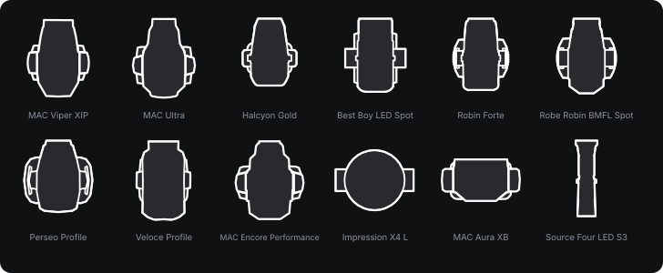

# Eos fixture symbols

## Disclaimer: Symbols collected and modified by code written by an LLM.

Magic-sheet symbols for ETC Eos, generated from publicly available manufacturer
data - GDTF files, DWG and CAD drawings - rather than drawn by hand. Every symbol
is a real fixture, built from that fixture's own published geometry.

## What is in the box

    gdtf/         symbols built from a GDTF's own 2D drawings (models/svg)
    gdtf3d/       symbols built from a GDTF's 3D meshes, assembled and projected
    index.html    contact sheet of the whole library
    showcase.svg  the panel above
    manifest.csv  every file and the group it belongs to

These are Eos symbols, ready to import - there is no separate color set.

## Using them in Eos

Import them as magic-sheet symbols. They follow the ETC symbol convention:

* `etc_symbol_base0` carries the filled silhouette. Eos tints this, so a symbol
  reads as a solid fixture and a channel number stays legible on top of it.
* `etc_symbol_outline` carries the outline, which takes channel color and
  intensity.
* There is no backing plate - a direct select or magic sheet frames the symbol
  already - and no `<text>`, since Eos does not render it.

## How a symbol is drawn

A fixture symbol is the plan view with the head tipped forward, which is how a
light actually reads on a plot. Wash units are drawn face-up instead, since that
is how they read. A few fixtures ship both: `_flat` is always the alternate of
whichever way the main symbol faces.

Symbols come from two places, and both are published because neither wins every
time:

* **gdtf/** uses the 2D drawings a manufacturer ships inside the GDTF. When they
  are good they are the best thing available, because they are what the
  manufacturer draws.
* **gdtf3d/** assembles the 3D meshes instead: each part is projected, the head
  is rotated on its tilt axis, and the parts are combined in depth order so the
  head occludes the yoke exactly as it would in life. This is the fallback when a
  manufacturer's 2D drawing is poor or missing, and for some brands it is the
  better symbol outright.

Either way the geometry is a true union of the fixture's own shapes, not a trace
or an approximation: one closed silhouette per part, with the interior lines that
make a yoke read as a yoke.

## Requesting a fixture

Open an issue using the **Fixture request** template and include:

* the manufacturer and the fixture's full name, as it appears on the product
  page rather than as it is patched (`Robin Forte`, not `Forte HP 16bit`)
* a link to its [GDTF Share](https://gdtf-share.com) page if you know of one

What decides whether a symbol can be built is not the code, it is whether the
published data carries geometry. Roughly half the archives on Share are channel
data only - no `models/svg`, no meshes - and there is nothing to draw from those.
Manufacturer DWG or CAD is the other route, so a link to one is just as useful.

If a fixture is simply not published anywhere, that is worth an issue too: it is
the honest answer to "why is my light missing", and it collects the requests in
one place.

## Provenance and licensing

Every symbol is generated from publicly available manufacturer data: GDTF files
published by manufacturers and the community on
[GDTF Share](https://gdtf-share.com), and manufacturer DWG and CAD drawings.

The underlying geometry belongs to those vendors. Their terms govern what you may
do with anything derived from it, so check before redistributing. The generators,
the drawing conventions and everything else here are original work.
